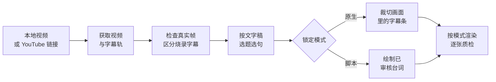

<a name="readme-top"></a>

<div align="center">
  

  <p><strong>把真实视频帧，做成保留原字幕或绘制台词的长图</strong><br>
  <sub>原生字幕不重绘 · 脚本字幕不冒充原字幕</sub></p>

  <p>
    <a href="#快速开始"><strong>快速开始</strong></a> &nbsp;·&nbsp;
    <a href="#能做什么">了解能力</a> &nbsp;·&nbsp;
    <a href="#成品案例">成品案例</a> &nbsp;·&nbsp;
    <a href="#两种字幕模式">两种模式</a> &nbsp;·&nbsp;
    <a href="README_EN.md">English</a> &nbsp;·&nbsp;
    <a href="README_KO.md">한국어</a>
  </p>

  <p>
    <a href="https://github.com/chengyi-ai/native-subtitle-quote-image/releases"></a>
    <a href="https://github.com/chengyi-ai/native-subtitle-quote-image/actions/workflows/validate.yml"></a>
    <a href="https://github.com/chengyi-ai/native-subtitle-quote-image/stargazers"></a>
    <a href="LICENSE"></a>
  </p>
</div>

## 能做什么

- **从视频直接出图**：本地文件或 YouTube 链接进来，经过找句子、精确取帧、拼图、逐张质检，输出原生或脚本字幕 JPG，可按内容布局或指定比例。
- **两种字幕，从不混用**：原生模式只裁切画面里本来就有的字幕；脚本模式把你审核过的台词画到真实画面上，并标明是后期字幕。
- **版式紧凑**：原生字幕先拼源像素，再统一缩放，第一句不会被单独放大；脚本固定布局的主图约占 70%。字幕条之间没有空隙。
- **Agent 能用，脚本也能单独跑**：在 Codex、Claude Code 等 Agent 里用一句话调用；也可以直接运行 Python 脚本。

## 成品案例

本页只展示中文字幕作品，均为 3:4、5 句。英文和韩文作品分别在 [English](README_EN.md#gallery) 与 [한국어](README_KO.md#완성-예시) README 中。点击图片查看原图。

<table>
  <tr>
    <td width="33%" align="center" valign="top"><strong>《大巴上的女孩》</strong><br><sub>原生字幕 · 生命属于你自己</sub><br><a href="examples/gallery/zh/girls-on-the-bus-native.jpg"></a></td>
    <td width="33%" align="center" valign="top"><strong>里克·鲁宾</strong><br><sub>脚本字幕 · 创意像一片变化的云</sub><br><a href="examples/gallery/zh/rick-rubin-creative-clouds.jpg"></a></td>
    <td width="33%" align="center" valign="top"><strong>陈数</strong><br><sub>脚本字幕 · 工作投入，生活简单</sub><br><a href="examples/gallery/zh/chen-shu-simple-life.jpg"></a></td>
  </tr>
</table>

- **原生字幕**：第一张的字幕是视频里已烧录的非官方中英双语字幕（随 Bilibili 搬运版烧录在画面里），直接从画面像素裁切，未识别、未重绘；左上角是原视频平台的水印。
- **脚本字幕**：后两张的中文是后期绘制的整理或翻译台词，不是视频原字幕，也不作为人物的逐字引语。

[查看来源、台词与时间点](examples/README.md#中文案例)

<div align="right"><a href="#readme-top">↑ 回到顶部</a></div>

## 快速开始

**1. 安装 Skill**

```bash
git clone https://github.com/chengyi-ai/native-subtitle-quote-image.git
cd native-subtitle-quote-image
mkdir -p ~/.codex/skills && cp -R skills/native-subtitle-quote-image ~/.codex/skills/
```

Windows PowerShell：

```powershell
New-Item -ItemType Directory -Force "$HOME\.codex\skills" | Out-Null
Copy-Item -Recurse skills\native-subtitle-quote-image "$HOME\.codex\skills\"
```

> 升级时请先删除旧目录再复制，否则新版本已删除的旧文件会残留（Claude Code 把 `.codex` 换成 `.claude`）：
>
> ```bash
> rm -rf ~/.codex/skills/native-subtitle-quote-image
> ```
>
> ```powershell
> Remove-Item -Recurse -Force "$HOME\.codex\skills\native-subtitle-quote-image"
> ```

<details>
<summary>用 Claude Code、Codex Skill Installer 或其他 Agent？</summary>

<br>

**Claude Code**：复制到 Claude Code 的 Skills 目录。

```bash
mkdir -p ~/.claude/skills && cp -R skills/native-subtitle-quote-image ~/.claude/skills/
```

Windows PowerShell：

```powershell
New-Item -ItemType Directory -Force "$HOME\.claude\skills" | Out-Null
Copy-Item -Recurse skills\native-subtitle-quote-image "$HOME\.claude\skills\"
```

**Codex Skill Installer**：在 Codex 中调用 `$skill-installer`，让它安装这个目录：

```text
https://github.com/chengyi-ai/native-subtitle-quote-image/tree/main/skills/native-subtitle-quote-image
```

**其他 Agent**：本项目使用开放的 Agent Skills 目录格式。把 `skills/native-subtitle-quote-image/` 复制到目标 Agent 的 Skills 目录即可，具体位置以该 Agent 的文档为准。

</details>

**2. 安装依赖并自检**

```bash
python3 -m pip install -r skills/native-subtitle-quote-image/requirements.txt
python3 skills/native-subtitle-quote-image/scripts/check_environment.py
```

要处理 YouTube 链接，再装 `yt-dlp`：

```bash
python3 -m pip install -U "yt-dlp[default]"
python3 skills/native-subtitle-quote-image/scripts/check_environment.py --url-mode
```

要画中日韩台词，用 `--script-mode` 检查字体。环境自检是只读的，不会自动安装或修改任何软件；缺组件时，Agent 会先说明用途，征得你同意再装。

**3. 重开一个 Agent 任务，说一句话**

```text
使用 $native-subtitle-quote-image，把这个带内嵌中文字幕的视频做成原生字幕拼图。
```

<div align="right"><a href="#readme-top">↑ 回到顶部</a></div>

## 两种字幕模式

如果你没有指定模式，Agent 会先问“您当前是选择原生字幕还是脚本字幕？”，并用一句话解释两者区别，再按你的选择处理。

| | 原生字幕 | 脚本字幕 |
|---|---|---|
| **什么时候用** | 关掉播放器的 CC 后，字幕仍然烧在画面里 | 要把已核对的台词、翻译或观点画到真实画面上 |
| **图里的字从哪来** | 视频像素本身，不 OCR 重绘，不翻译改写 | 你审核过的 `lines[].text`，明确属于后期字幕 |
| **命令** | `render` | `render-script` |

> [!IMPORTANT]
> 原生模式的字只能来自视频像素；脚本模式的字只能来自已审核的 JSON，不能冒充原字幕。
> 如果你要原生字幕，但视频只有可开关的字幕轨，Agent 会先说明限制，经你同意后才改用脚本模式。

### 工作流



Skill 支持三种工作方式：

1. **本地成片**：直接从本地视频选句、取帧、出图，不需要 `yt-dlp`。
2. **URL 完整流程**：用 `yt-dlp` 获取你有权处理的视频、元数据和辅助字幕轨，再决定字幕模式。
3. **内容生产**：读视频、选题、写文章或帖子，最后配字幕截图。其他内容类 Skill 负责上游，本 Skill 负责时间点、真实画面、字幕来源标识和质检。

<div align="right"><a href="#readme-top">↑ 回到顶部</a></div>

## 用一句话调用

| 场景 | 对 Agent 说 |
|---|---|
| 视频自带烧录字幕 | 使用 $native-subtitle-quote-image，把这个带内嵌中文字幕的视频做成原生字幕拼图。 |
| 给的是链接 | 使用 $native-subtitle-quote-image，读取这个 YouTube 链接，先检查下载权限和烧录字幕，再选 3 个适合传播的主题，做成原生字幕拼图并逐张质检。 |
| 写稿配图一起做 | 先根据视频文字稿提炼选题并写文章，再用 $native-subtitle-quote-image 为每个核心观点选真实视频帧并出图；先判断原生或脚本字幕模式，不要混用。 |
| 用自己核对过的台词 | 使用 $native-subtitle-quote-image 的脚本字幕模式，把这份带时间点的中文台词画到真实视频帧上，做成紧凑 3:4 长图并逐张质检。 |

> [!TIP]
> `$native-subtitle-quote-image` 是 Codex 的写法。在 Claude Code 里可以用 `/native-subtitle-quote-image`，或者直接描述需求。

Agent 会先检查来源、字幕类型和候选帧，确定模式后再生成：

- 逐张 JPG，比例符合所选布局；
- 原生模式的 `原生字幕时间点.json`，或脚本模式的 `lines` JSON；
- 多图任务的 `final_contact_sheet.jpg` 总览图。

<div align="right"><a href="#readme-top">↑ 回到顶部</a></div>

## 命令行

不经过 Agent 也可以直接跑脚本。下面的 `VIDEO` 换成你的视频路径。

**自检来源**：下载后先检查分辨率并解码前 10 秒，坏流或低清在抽帧前就失败（不传 `--min-height` 时低于 720p 只警告）。

```bash
python3 skills/native-subtitle-quote-image/scripts/native_subtitle_stitch.py check-source VIDEO --min-height 720
```

**挑帧**：生成带时间点的候选帧总览，不用反复试时间点。

```bash
python3 skills/native-subtitle-quote-image/scripts/native_subtitle_stitch.py sample VIDEO \
  --start 30 --end 120 --interval 5 --out candidate-contact-sheet.jpg
```

不传 `--start`、`--end` 和 `--interval` 时，会在整段视频里均匀抽取最多 24 帧。已经知道大概时间点时，可以围绕每个点取前、中、后三帧，避开字幕切换的瞬间：

```bash
python3 skills/native-subtitle-quote-image/scripts/native_subtitle_stitch.py sample VIDEO \
  -t 61.2 -t 68.9 -t 74.5 -t 82.0 -t 88.4 \
  --around 0.8 --out focused-candidates.jpg
```

**原生字幕**：先用 `band` 确认字幕的裁切区域，再按 manifest 渲染一组成品。

```bash
python3 skills/native-subtitle-quote-image/scripts/native_subtitle_stitch.py band VIDEO \
  -t 61.2 --band-top 0.78 --band-bottom 0.96 --out band-preview.jpg

python3 skills/native-subtitle-quote-image/scripts/native_subtitle_stitch.py render VIDEO \
  --manifest manifest.json --out-dir output-v1 \
  --band-top 0.78 --band-bottom 0.96
```

**脚本字幕**：准备 `script.json`，然后渲染。

```bash
python3 skills/native-subtitle-quote-image/scripts/native_subtitle_stitch.py render-script VIDEO \
  --script script.json --out output.jpg --aspect 3:4 --width 1440
```

**可选六句卡**：`script.json` 中放 6 句已核对、时间点严格递增的台词。此预设在 1080×1440 画布上使用 870px 主画面和下方 5 条各 114px 的连续字幕条，首句与后五句等距；默认脚本布局不变。

```bash
python3 skills/native-subtitle-quote-image/scripts/native_subtitle_stitch.py render-script VIDEO \
  --script script.json --out six-line.jpg --six-line-card --aspect 3:4 --width 1080
```

`--six-line-card` 仅用于后期绘制的脚本字幕，不接受 `--layout natural` 或 `--hero-fraction`。字幕条默认从源画面高度的 60% 处取样，可用 `--band-center` 调整；仍须逐句核对来源和逐张检查画面。

**保留人物原比例与横屏构图（v2.2.0）**：两种字幕模式都支持 `--layout natural`。不指定宽度时保留源宽度，图片高度按实际内容计算，不强制 3:4；指定 `--width` 也只做等比缩放。

```bash
# 原生字幕：保留画面像素，不重绘文字
python3 skills/native-subtitle-quote-image/scripts/native_subtitle_stitch.py render VIDEO \
  --manifest manifest.json --out-dir output-natural --layout natural

# 脚本字幕：仅裁去不需要的底部区域，不把剩余画面拉高
python3 skills/native-subtitle-quote-image/scripts/native_subtitle_stitch.py render-script VIDEO \
  --script script.json --out natural.jpg --layout natural --frame-bottom 0.72
```

`0.72` 是示例裁切边界，需按视频实测；默认 `--frame-top 0 --frame-bottom 1` 保留全帧。`--band-center` 相对裁切后的画面。原比例布局不与 `--aspect` / `--hero-fraction` 合用。“原比例”只描述画面几何，脚本字幕仍是后期绘制。

**默认原生布局修正（v2.2.2）**：`render` 不传布局或比例时，默认按内容计算高度、保留源宽度。明确加 `--aspect 3:4 --width 1440` 时仍输出 1440×1920，但对整张拼图统一等比缩放，保留完整字幕，不分别填满主图和字幕条（v2.2.2 用留黑边适配画布，v2.3.0 起默认先统一裁两侧，见下）。原生模式的 `--hero-fraction` 仅调整源主图裁切高度，受源帧限制；脚本字幕仍默认固定 3:4。输出比例不匹配时，不能用非等比 resize 硬改。

**横屏视频出 3:4 少留黑边（v2.3.0）**：原生 `render` 的固定画布默认 `--fit crop`：先自动识别每句字幕的左右边界，再对整张拼图统一裁去两侧，最多裁到字幕安全边界，剩余差额才留黑边。所有字幕仍是同一缩放倍数；任何一句识别不到字幕边界时不裁切，退回整图留边。人物偏左或偏右时，用 `--crop-center 0.4` 这类数值移动裁切窗口，窗口始终包含全部字幕。想要 v2.2.2 的纯留边效果，加 `--fit pad`。裁切后仍要逐张检查字幕两端是否完整。

<details>
<summary><code>script.json</code> 的格式</summary>

<br>

每个 `text` 必须是已复核的单行台词，`t` 是严格递增的真实时间点：

```json
{
  "lines": [
    {"t": 61.6, "text": "第一句已核对台词"},
    {"t": 69.3, "text": "第二句已核对台词"},
    {"t": 75.0, "text": "第三句已核对台词"},
    {"t": 82.4, "text": "第四句已核对台词"},
    {"t": 88.8, "text": "第五句已核对台词"}
  ]
}
```

脚本会自动尝试常见的系统 CJK 字体（台词含韩文时优先 Apple SD Gothic Neo / Malgun Gothic），找不到时用 `--font /path/to/font.ttc` 指定。台词太长就拆句，不要靠缩小字号硬塞。

</details>

几条默认行为：

- 两种渲染器都会根据字幕条数自动调整主图比例，详见[紧凑型视觉规范](skills/native-subtitle-quote-image/references/visual-style.md)。
- 原生单行字幕默认从视频高度的 `0.78–0.96` 区域开始预览。
- 每张图最多 7 个时间点（1 个主画面 + 6 个字幕条），两种模式相同；台词更多时拆成多张图。
- 默认不覆盖已有图片；确实要替换时加 `--overwrite`。
- 出图前会检查重复画面：所有时间点画面几乎相同（例如源视频只是一张静态封面图），或原生模式相邻两条字幕条几乎相同时，直接报错、不出图。确认无误时加 `--allow-duplicate-frames`。
- 完整参数用 `--help` 查看。

<div align="right"><a href="#readme-top">↑ 回到顶部</a></div>

## 适合与不适合

| 适合 | 不适合 |
|---|---|
| 关掉 CC 后字幕仍在画面里，想原样保留 | 想要原生字幕，但视频只有可单独开关、切换或下载的字幕轨 |
| 手里有可复核的时间点和已审核台词，想画到真实画面上 | 台词或翻译还没复核，或者希望 Agent 编造来源里没有的引语 |
| 你有权处理和发布这段视频及生成的画面 | 想把低清视频"增强"成真实的高清画质 |

素材优先用自己拍摄并加过字幕的视频、已获授权的素材，或明确允许再利用的公开视频。公开发布前，请再确认一遍素材使用权。

<details>
<summary><strong>找不到带烧录字幕的视频怎么办</strong></summary>

<br>

很多视频的字幕是播放器里可开关的字幕轨（CC），下载下来的画面是干净的，这类视频做不了原生模式。

**先判断**：关掉播放器字幕再看画面；或者下载后用 `sample` 生成候选帧总览，画面里仍有字幕才是烧录字幕。只下载到 VTT/SRT 字幕文件，不代表画面里有字幕。

**更容易找到的来源**：

- 自己剪辑的视频：用剪映、Premiere 等导出时把字幕烧进画面，最稳，也没有版权顾虑。
- 发布方自己加了中文字幕的访谈、节目或发布会视频。
- 平台上带中文硬字幕的访谈、播客切片。这类视频常是二次搬运，发布前务必确认使用权。

**还是找不到**：改用脚本字幕模式。用视频自带的字幕轨或 Whisper 文字稿定位时间点，核对台词后写进 `script.json`，再运行 `render-script`。成品会标明是后期字幕，不冒充原字幕。

</details>

<div align="right"><a href="#readme-top">↑ 回到顶部</a></div>

## 更多说明

<details>
<summary><strong>项目状态与技术信息</strong></summary>

<p>
  
  <a href="skills/native-subtitle-quote-image"></a>
  <a href=".codex-plugin/plugin.json"></a>
  <a href="https://github.com/chengyi-ai/native-subtitle-quote-image/releases"></a>
  <a href="https://github.com/chengyi-ai/native-subtitle-quote-image/commits/main"></a>
  <a href="https://github.com/chengyi-ai/native-subtitle-quote-image/network/members"></a>
  <a href="https://github.com/chengyi-ai/native-subtitle-quote-image/issues"></a>
</p>

</details>

<details>
<summary><strong>依赖组件一览</strong></summary>

<br>

| 组件 | 本地模式 | URL 模式 | 用途 |
|---|:---:|:---:|---|
| `native-subtitle-quote-image` | 必需 | 必需 | 选帧、裁切、拼图和最终质检 |
| Python 3.10+ | 必需 | 必需 | 运行 Skill 脚本 |
| Pillow | 必需 | 必需 | 裁图、拼图、导出 JPG |
| `imageio-ffmpeg` 或 FFmpeg | 必需 | 必需 | 读取视频、精确取帧 |
| `yt-dlp` | — | 必需 | 获取在线视频、元数据和字幕轨 |
| Deno，或显式启用 Node.js | — | YouTube 必需 | 完整解析 YouTube 格式 |
| Whisper / 语音识别 Skill | 可选 | 可选 | 没有字幕轨时生成时间索引 |
| CJK 字体 | 中日韩脚本模式必需 | 中日韩脚本模式必需 | 绘制中日韩台词；原生模式不需要 |
| 选题、写作或视频理解 Skill | 可选 | 可选 | 从文字稿提名主题、生产配套内容 |

</details>

<details>
<summary><strong>YouTube 提示"登录以确认不是机器人"怎么办</strong></summary>

<br>

URL 模式会先尝试公开访问。如果 YouTube 返回登录验证、年龄验证，或者是你自己的非公开视频，Agent 不会误判成"只能处理本地视频"，而是说明原因，并询问你是否允许 `yt-dlp` 临时读取 Chrome 里的登录 Cookie。

你授权后，元数据、字幕和视频下载命令都会加上 `--cookies-from-browser chrome`：

```bash
yt-dlp --cookies-from-browser chrome --js-runtimes node \
  --no-playlist --skip-download \
  --print "%(id)s | %(title)s | %(duration_string)s" \
  "URL"
```

Cookie 不导出、不保存、不上传，也不写进仓库。yt-dlp 官方目前推荐用 Deno 做 JavaScript 运行时；已经装了 Node.js 的话也可以用，但要加 `--js-runtimes node`。完整授权边界和故障处理见 [URL 获取参考](skills/native-subtitle-quote-image/references/yt-dlp-and-transcripts.md#chrome-cookie-授权流程)。

</details>

<details>
<summary><strong>更新提醒</strong></summary>

<br>

每个新任务开始时，Skill 会做一次不阻塞任务的版本检查：读取自带的 `VERSION`，和本项目 GitHub 上的 Latest Release 比较。

```bash
python3 skills/native-subtitle-quote-image/scripts/check_update.py --json
```

- 24 小时内复用缓存，不会每次都联网。
- 发现新版本只提醒版本号和 Release 链接，不会自动覆盖你本地的 Skill。
- 断网、GitHub 不可用或你拒绝联网时，照常继续任务。
- 缓存里只有检查时间、最新版本号和 Release 链接，没有账号、素材或使用记录。

想立刻重新检查：

```bash
python3 skills/native-subtitle-quote-image/scripts/check_update.py --force --verbose
```

</details>

<details>
<summary><strong>修改头图</strong></summary>

<br>

头图由 `scripts/render_banners.py` 生成，中文、英文、韩文各一张 2560×1280 的 JPG，放在 `assets/` 里。背景铺满 `examples/gallery` 的成品案例，自带深色底，GitHub 浅色和深色主题共用。改文字时编辑脚本顶部的 `COPY`，改背景墙用哪些案例时编辑 `WALL`，然后运行：

```bash
python3 scripts/render_banners.py
```

需要本机装有 Chrome 或 Chromium，渲染时会从 Google Fonts 加载字体。找不到浏览器时，用 `--chrome /path/to/chrome` 指定。Linux 上若图片底部被截掉一截，改用 `chrome-headless-shell` 渲染。

中文头图 `assets/banner-zh.jpg` 同时用作仓库社交预览图：在仓库 Settings → General → Social preview 上传，分享仓库链接时就会显示。

</details>

<details>
<summary><strong>项目验证</strong></summary>

<br>

```bash
python3 scripts/validate_repo.py
python3 -m unittest discover -s tests -v
python3 skills/native-subtitle-quote-image/scripts/check_environment.py
python3 skills/native-subtitle-quote-image/scripts/native_subtitle_stitch.py --help
python3 skills/native-subtitle-quote-image/scripts/native_subtitle_stitch.py render-script --help
```

每次推送和 Pull Request 都会在 Python 3.10 和 3.13 上通过 GitHub Actions 自动检查。

</details>

**深入文档**

- [URL 获取、yt-dlp、Deno/Node 与文字时间轴](skills/native-subtitle-quote-image/references/yt-dlp-and-transcripts.md)
- [从读视频、选题到交付的完整工作流](skills/native-subtitle-quote-image/references/end-to-end-workflow.md)
- [紧凑型主图、字幕条密度与视觉质检](skills/native-subtitle-quote-image/references/visual-style.md)

## 反馈与贡献

欢迎在 [Issues](https://github.com/chengyi-ai/native-subtitle-quote-image/issues) 提问题或建议，渲染问题请附上出问题那一页的截图；也可以在社交媒体上直接找作者反馈。新 issue 会由 Agent 自动评估可行性，符合条件的需求由 Agent 编码、测试并提交 PR，维护者审查合并后自动发版。完整流程见 [Agent 工作流说明](docs/agent-workflow.md)。

## Star History

<a href="https://www.star-history.com/?repos=chengyi-ai%2Fnative-subtitle-quote-image&type=date&legend=top-right">
  <picture>
    <source media="(prefers-color-scheme: dark)" srcset="https://api.star-history.com/chart?repos=chengyi-ai/native-subtitle-quote-image&type=date&theme=dark&legend=top-left" />
    <source media="(prefers-color-scheme: light)" srcset="https://api.star-history.com/chart?repos=chengyi-ai/native-subtitle-quote-image&type=date&legend=top-left" />
    
  </picture>
</a>

<p align="center">
  <a href="https://trendshift.io/repositories/169845?utm_source=trendshift-badge&amp;utm_medium=badge&amp;utm_campaign=badge-trendshift-169845" target="_blank" rel="noopener noreferrer"></a>
  <a href="https://trendshift.io/repositories/169845?utm_source=trendshift-badge&amp;utm_medium=badge&amp;utm_campaign=badge-trendshift-169845" target="_blank" rel="noopener noreferrer"></a>
</p>

## 关于作者

| 平台 | 账号 |
| --- | --- |
| 𝕏 Twitter | [@ChengYi3629](https://x.com/ChengYi3629) |
| 📕 小红书 | [程意](https://www.xiaohongshu.com/user/profile/648c0e99000000001001f148) |

## 开源许可

代码与 Skill 指令采用 [MIT License](LICENSE)。示例图片只用于展示输出效果；输入视频、生成图片及其中出现的第三方内容，不因本许可证获得额外授权。

<div align="right"><a href="#readme-top">↑ 回到顶部</a></div>
