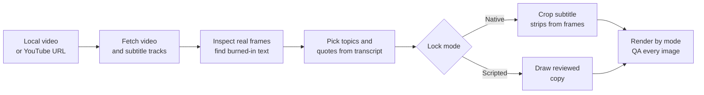

<a name="readme-top"></a>

<div align="center">
  

  <p><strong>Turn real video frames into native or scripted subtitle quote images</strong><br>
  <sub>Native subtitles stay untouched · Scripted subtitles are clearly identified</sub></p>

  <p>
    <a href="#quick-start"><strong>Quick start</strong></a> &nbsp;·&nbsp;
    <a href="#what-it-does">What it does</a> &nbsp;·&nbsp;
    <a href="#gallery">Gallery</a> &nbsp;·&nbsp;
    <a href="#two-subtitle-modes">Two modes</a> &nbsp;·&nbsp;
    <a href="README.md">中文</a> &nbsp;·&nbsp;
    <a href="README_KO.md">한국어</a>
  </p>

  <p>
    <a href="https://github.com/chengyi-ai/native-subtitle-quote-image/releases"></a>
    <a href="https://github.com/chengyi-ai/native-subtitle-quote-image/actions/workflows/validate.yml"></a>
    <a href="https://github.com/chengyi-ai/native-subtitle-quote-image/stargazers"></a>
    <a href="LICENSE"></a>
  </p>
</div>

## What it does

- **Video in, images out**: start from a local file or a YouTube URL. The Skill finds quotes, extracts exact frames, lays out the collage, and checks every image before delivering native or scripted subtitle JPGs, with content-driven or explicit aspect ratios.
- **Two subtitle modes, never mixed**: native mode only crops subtitles already burned into the frame; scripted mode draws your reviewed copy onto real frames and labels it as post-produced.
- **Compact layout**: native subtitles are stacked as source pixels and scaled together, without enlarging the first line separately. Scripted fixed layouts keep about 70% for the hero. Strips sit flush with no gaps.
- **Agent-first, script-friendly**: call it with one sentence in Codex, Claude Code, or another agent, or run the Python scripts directly.

## Gallery

English-subtitle examples only, all 3:4 with 5 lines. Chinese and Korean examples live in the [中文](README.md#成品案例) and [한국어](README_KO.md#완성-예시) READMEs. Click any image for full size.

<table>
  <tr>
    <td width="33%" align="center" valign="top"><strong>Mikayla Johnson</strong><br><sub>Scripted · Define the outcome first</sub><br><a href="examples/gallery/en/mikayla-johnson-define-outcome.jpg"></a></td>
    <td width="33%" align="center" valign="top"><strong>Rick Rubin</strong><br><sub>Scripted · Be yourself, not a mask</sub><br><a href="examples/gallery/en/rick-rubin-be-yourself.jpg"></a></td>
    <td width="33%" align="center" valign="top"><strong>Darby Saxbe</strong><br><sub>Scripted · Share the load early</sub><br><a href="examples/gallery/en/darby-saxbe-shared-care.jpg"></a></td>
  </tr>
</table>

All three use **scripted subtitles**: edited English copy drawn onto real frames. They are not the videos' original captions and not verbatim quotations. For a native (burned-in) subtitle example, see the Chinese README.

[Sources, lines, and timestamps](examples/README.md#english-examples)

<div align="right"><a href="#readme-top">↑ Back to top</a></div>

## Quick start

**1. Install the Skill**

```bash
git clone https://github.com/chengyi-ai/native-subtitle-quote-image.git
cd native-subtitle-quote-image
mkdir -p ~/.codex/skills && cp -R skills/native-subtitle-quote-image ~/.codex/skills/
```

Windows PowerShell:

```powershell
New-Item -ItemType Directory -Force "$HOME\.codex\skills" | Out-Null
Copy-Item -Recurse skills\native-subtitle-quote-image "$HOME\.codex\skills\"
```

> When upgrading, delete the old directory before copying, otherwise files removed in the new version will linger (for Claude Code, replace `.codex` with `.claude`):
>
> ```bash
> rm -rf ~/.codex/skills/native-subtitle-quote-image
> ```
>
> ```powershell
> Remove-Item -Recurse -Force "$HOME\.codex\skills\native-subtitle-quote-image"
> ```

<details>
<summary>Using Claude Code, the Codex Skill Installer, or another agent?</summary>

<br>

**Claude Code**: copy the Skill into Claude Code's Skills directory.

```bash
mkdir -p ~/.claude/skills && cp -R skills/native-subtitle-quote-image ~/.claude/skills/
```

Windows PowerShell:

```powershell
New-Item -ItemType Directory -Force "$HOME\.claude\skills" | Out-Null
Copy-Item -Recurse skills\native-subtitle-quote-image "$HOME\.claude\skills\"
```

**Codex Skill Installer**: ask `$skill-installer` in Codex to install this directory:

```text
https://github.com/chengyi-ai/native-subtitle-quote-image/tree/main/skills/native-subtitle-quote-image
```

**Other agents**: the Skill uses the open Agent Skills directory format. Copy `skills/native-subtitle-quote-image/` into your agent's Skills directory and follow that agent's activation instructions.

</details>

**2. Install dependencies and run the self-check**

```bash
python3 -m pip install -r skills/native-subtitle-quote-image/requirements.txt
python3 skills/native-subtitle-quote-image/scripts/check_environment.py
```

For YouTube URLs, also install `yt-dlp`:

```bash
python3 -m pip install -U "yt-dlp[default]"
python3 skills/native-subtitle-quote-image/scripts/check_environment.py --url-mode
```

To draw Chinese, Japanese, or Korean copy, check fonts with `--script-mode`. The checker is read-only and never installs or changes software; when something is missing, the agent explains why it is needed and asks before installing it.

**3. Open a new agent task and ask**

```text
Use $native-subtitle-quote-image to turn this video with burned-in subtitles into native subtitle quote images.
```

<div align="right"><a href="#readme-top">↑ Back to top</a></div>

## Two subtitle modes

If you have not chosen a mode, the agent first asks whether you want native or scripted subtitles, briefly explains the difference, and waits for your choice.

| | Native subtitles | Scripted subtitles |
|---|---|---|
| **Use it when** | Subtitles stay in the frame after the player's CC is turned off | You want reviewed quotes, translations, or points drawn onto real frames |
| **Where the text comes from** | Video pixels only; no OCR redraw, translation, or rewriting | Your reviewed `lines[].text`, clearly labeled as post-produced |
| **Command** | `render` | `render-script` |

> [!IMPORTANT]
> Native-mode text comes only from video pixels. Scripted-mode text comes only from reviewed JSON and is never presented as native.
> If you ask for native subtitles but the video only has a switchable track, the agent explains the limitation and switches to scripted mode only after you agree.

### Workflow



Three ways to work:

1. **Local video**: pick quotes, extract frames, and render from a local file. No `yt-dlp` needed.
2. **Full URL flow**: use `yt-dlp` to fetch a video you have the right to process, with metadata and auxiliary subtitle tracks, then choose a subtitle mode.
3. **Content production**: read the video, pick topics, write an article or post, and finish with subtitle images. Upstream content Skills handle analysis; this Skill owns timestamps, real frames, subtitle-source labels, and QA.

<div align="right"><a href="#readme-top">↑ Back to top</a></div>

## One prompt away

| Situation | Say to your agent |
|---|---|
| Video has burned-in subtitles | Use $native-subtitle-quote-image to turn this video with burned-in subtitles into native subtitle quote images. |
| You have a URL | Use $native-subtitle-quote-image with this YouTube URL. Check download rights and burned-in subtitles first, then select three useful themes, create native subtitle collages, and inspect every image. |
| Article and images together | Use the timestamped transcript to choose topics and draft the article, then use $native-subtitle-quote-image to select real frames for each core point. Choose native or scripted subtitle mode explicitly and do not mix them. |
| Your own reviewed English copy | Use $native-subtitle-quote-image in scripted-subtitle mode. Draw this reviewed timestamped English copy onto real video frames, create compact 3:4 images, and visually inspect every result. |

> [!TIP]
> `$native-subtitle-quote-image` is Codex syntax. In Claude Code, use `/native-subtitle-quote-image` or simply describe what you want.

The agent checks the source, subtitle type, and candidate frames, locks the mode, then delivers:

- JPG files matching the selected layout;
- `原生字幕时间点.json` for native mode, or a `lines` JSON for scripted mode;
- `final_contact_sheet.jpg` for multi-image deliveries.

<div align="right"><a href="#readme-top">↑ Back to top</a></div>

## Command line

You can also run the scripts without an agent. Replace `VIDEO` with your video path.

**Check the source**: after download, verify resolution and decode the first 10 seconds so broken or low-res sources fail before frame extraction (without `--min-height`, below 720p only warns).

```bash
python3 skills/native-subtitle-quote-image/scripts/native_subtitle_stitch.py check-source VIDEO --min-height 720
```

**Pick frames**: build a timestamped candidate sheet instead of guessing timestamps.

```bash
python3 skills/native-subtitle-quote-image/scripts/native_subtitle_stitch.py sample VIDEO \
  --start 30 --end 120 --interval 5 --out candidate-contact-sheet.jpg
```

Without `--start`, `--end`, and `--interval`, it samples up to 24 frames evenly across the video. If you already know rough timestamps, grab before/middle/after frames around each one to avoid catching a subtitle mid-transition:

```bash
python3 skills/native-subtitle-quote-image/scripts/native_subtitle_stitch.py sample VIDEO \
  -t 61.2 -t 68.9 -t 74.5 -t 82.0 -t 88.4 \
  --around 0.8 --out focused-candidates.jpg
```

**Native subtitles**: confirm the subtitle crop with `band`, then render from a manifest.

```bash
python3 skills/native-subtitle-quote-image/scripts/native_subtitle_stitch.py band VIDEO \
  -t 61.2 --band-top 0.78 --band-bottom 0.96 --out band-preview.jpg

python3 skills/native-subtitle-quote-image/scripts/native_subtitle_stitch.py render VIDEO \
  --manifest manifest.json --out-dir output-v1 \
  --band-top 0.78 --band-bottom 0.96
```

**Scripted subtitles**: prepare `script.json`, then render.

```bash
python3 skills/native-subtitle-quote-image/scripts/native_subtitle_stitch.py render-script VIDEO \
  --script script.json --out output.jpg --aspect 3:4 --width 1440
```

**Optional six-line card**: put six reviewed lines with strictly increasing timestamps in `script.json`. At 1080×1440, this preset uses an 870px hero and five contiguous 114px strips, with equal spacing between all six line centers. The existing scripted layout remains the default.

```bash
python3 skills/native-subtitle-quote-image/scripts/native_subtitle_stitch.py render-script VIDEO \
  --script script.json --out six-line.jpg --six-line-card --aspect 3:4 --width 1080
```

`--six-line-card` applies only to post-produced scripted subtitles and cannot be combined with `--layout natural` or `--hero-fraction`. The strip sampling center defaults to 60% of source-frame height and can be changed with `--band-center`. Review every source line and rendered image.

**Preserve source proportions and the wide composition (v2.2.0)**: both subtitle modes support `--layout natural`. Without `--width`, the source width is retained and the height follows the stacked content instead of a forced 3:4 canvas. An explicit width uses proportional scaling only.

```bash
# Native subtitles: retain frame pixels, without redrawing text
python3 skills/native-subtitle-quote-image/scripts/native_subtitle_stitch.py render VIDEO \
  --manifest manifest.json --out-dir output-natural --layout natural

# Scripted subtitles: crop the unwanted bottom region, without stretching it back
python3 skills/native-subtitle-quote-image/scripts/native_subtitle_stitch.py render-script VIDEO \
  --script script.json --out natural.jpg --layout natural --frame-bottom 0.72
```

`0.72` is an example crop boundary, not a universal preset. The defaults `--frame-top 0 --frame-bottom 1` keep the full frame. `--band-center` refers to the cropped frame. Natural layout cannot be combined with `--aspect` or `--hero-fraction`. Source proportions describe geometry, not subtitle provenance: scripted subtitles remain post-rendered.

**Native default layout fix (v2.2.2)**: `render` now defaults to content-driven height and source width when neither layout nor aspect is supplied. Explicit `--aspect 3:4 --width 1440` still produces 1440×1920, but the entire collage is scaled as one image instead of independently filling each panel (v2.2.2 fits the canvas with black borders; v2.3.0 crops both sides first by default, see below). This preserves complete subtitles and their relative size. Native `--hero-fraction` only adjusts the source hero crop, bounded by available pixels. Scripted rendering still defaults to fixed 3:4. Never force the output ratio with non-proportional resizing.

**Fewer black bars for wide video in 3:4 (v2.3.0)**: the native fixed canvas now defaults to `--fit crop`. The renderer detects the left and right edges of every subtitle, crops both sides of the whole collage uniformly up to the subtitle safety margin, and pads only what remains. All subtitles keep one scale factor. If any subtitle's edges cannot be detected, nothing is cropped and the collage is padded as before. When the speaker sits off-center, shift the crop window with a value such as `--crop-center 0.4`; the window always keeps every subtitle. Use `--fit pad` for the v2.2.2 padding-only result. Still inspect both ends of every subtitle after cropping.

<details>
<summary><code>script.json</code> format</summary>

<br>

Every `text` value must be reviewed, single-line copy, and every `t` must be a strictly increasing real timestamp:

```json
{
  "lines": [
    {"t": 61.6, "text": "First reviewed line"},
    {"t": 69.3, "text": "Second reviewed line"},
    {"t": 75.0, "text": "Third reviewed line"},
    {"t": 82.4, "text": "Fourth reviewed line"},
    {"t": 88.8, "text": "Fifth reviewed line"}
  ]
}
```

The script tries common system CJK fonts (Apple SD Gothic Neo / Malgun Gothic first when the copy contains Hangul). If none is found, pass `--font /path/to/font.ttc`. Split overly long copy instead of forcing it into an unreadably small font.

</details>

Defaults worth knowing:

- Both renderers adjust hero height to the number of subtitle strips. See the [compact visual style guide](skills/native-subtitle-quote-image/references/visual-style.md).
- Native one-line subtitles are previewed from the `0.78–0.96` band of the source height.
- Each image takes at most 7 timestamps (1 hero + 6 strips) in both modes; split longer passages into several images.
- Existing images are never overwritten unless you pass `--overwrite`.
- Before rendering, both modes check for duplicate frames. If every timestamp yields nearly the same picture (for example, the source is a static cover image) or, in native mode, two adjacent subtitle strips are nearly identical, the command stops without writing images. Pass `--allow-duplicate-frames` once you have confirmed it is intended.
- Run `--help` for all options.

<div align="right"><a href="#readme-top">↑ Back to top</a></div>

## Scope

| Good fit | Not a fit |
|---|---|
| Subtitles stay in the frame after CC is off, and you want them as-is | You want native subtitles, but the video only has a switchable or downloadable track |
| You have verifiable timestamps and reviewed copy to draw onto real frames | The copy or translation is unreviewed, or you want quotes the source never said |
| You have the right to process and publish the video and generated frames | You want low-resolution footage "enhanced" into genuinely high-resolution footage |

Prefer footage you created and subtitled, licensed material, or public video that clearly permits reuse. Confirm usage rights again before publishing.

<details>
<summary><strong>Can't find videos with burned-in subtitles?</strong></summary>

<br>

Many videos carry subtitles as a switchable player track (CC). The downloaded frames are clean, so native mode can't use them.

**Check first**: turn off player captions and look at the frame, or download the video and run `sample` for a contact sheet. Only subtitles that remain in the pixels are burned in. Getting a VTT/SRT file does not mean the frames contain subtitles.

**Where they are easier to find**:

- Your own edits: export from CapCut, Premiere, or similar with subtitles burned in. Most reliable, and no rights questions.
- Interviews, shows, or launch videos where the publisher added subtitles themselves.
- Interview or podcast clips with hard-coded subtitles on video platforms. These are often re-uploads, so confirm usage rights before publishing.

**Still nothing?** Switch to script mode. Use the video's subtitle track or a Whisper transcript to locate timestamps, write reviewed copy into `script.json`, and run `render-script`. The output is labeled as added subtitles and never passes as the original.

</details>

<details>
<summary><strong>Interviews and other multi-speaker videos</strong></summary>

<br>

The collage simply follows timestamp order and does not know who is speaking. Subtitle strips only show the bottom of each frame, so readers assume every line belongs to the person in the hero frame. YouTube subtitle tracks and plain Whisper transcripts carry no speaker labels either. Picking "a few consecutive lines" from a multi-speaker video therefore tends to splice the host's questions into the guest's answers, which reads as jumbled and misattributed.

The Skill now handles this as follows:

- It labels speakers in the transcript before picking lines, checks unclear lines against the frames, and drops lines it still can't attribute.
- By default one image holds one speaker's lines, and the hero frame shows that speaker talking.
- For a question-and-answer layout it asks you first, and the question and answer must be adjacent in the source. Native mode can't add speaker labels to the frames, so the delivery notes name the speaker of every line.
- YouTube auto-captions roll, so the same line repeats and starts early. They are deduplicated before timestamps are chosen.

You can say it up front: "This is a two-person interview; use only consecutive lines from the guest."

</details>

<div align="right"><a href="#readme-top">↑ Back to top</a></div>

## More details

<details>
<summary><strong>Project status and tech details</strong></summary>

<p>
  
  <a href="skills/native-subtitle-quote-image"></a>
  <a href=".codex-plugin/plugin.json"></a>
  <a href="https://github.com/chengyi-ai/native-subtitle-quote-image/releases"></a>
  <a href="https://github.com/chengyi-ai/native-subtitle-quote-image/commits/main"></a>
  <a href="https://github.com/chengyi-ai/native-subtitle-quote-image/network/members"></a>
  <a href="https://github.com/chengyi-ai/native-subtitle-quote-image/issues"></a>
</p>

</details>

<details>
<summary><strong>Components</strong></summary>

<br>

| Component | Local mode | URL mode | Role |
|---|:---:|:---:|---|
| `native-subtitle-quote-image` | Required | Required | Frame selection, cropping, collage rendering, and final QA |
| Python 3.10+ | Required | Required | Runs the Skill scripts |
| Pillow | Required | Required | Cropping, collage composition, and JPG export |
| `imageio-ffmpeg` or FFmpeg | Required | Required | Video decoding and exact frame extraction |
| `yt-dlp` | — | Required | Online video, metadata, and subtitle-track acquisition |
| Deno, or explicitly enabled Node.js | — | Required for YouTube | Full YouTube format extraction |
| Whisper / speech-to-text Skill | Optional | Optional | Builds a timeline when no subtitle track is available |
| CJK font | Required for CJK scripted copy | Required for CJK scripted copy | Draws Chinese, Japanese, or Korean copy; not needed in native mode |
| Topic, writing, or video-understanding Skill | Optional | Optional | Proposes themes and produces companion content |

</details>

<details>
<summary><strong>YouTube says "Sign in to confirm you're not a bot"</strong></summary>

<br>

URL mode starts with a public request. If YouTube responds with a login check, an age check, or an access check for your own non-public video, the agent will not misdiagnose the Skill as local-only. It explains the error and asks whether `yt-dlp` may temporarily read your signed-in Chrome session.

After you approve, metadata, subtitle, and video commands for that URL all keep `--cookies-from-browser chrome`:

```bash
yt-dlp --cookies-from-browser chrome --js-runtimes node \
  --no-playlist --skip-download \
  --print "%(id)s | %(title)s | %(duration_string)s" \
  "URL"
```

Cookies are never exported, saved, uploaded, or committed. yt-dlp currently recommends Deno as its JavaScript runtime; an existing Node.js install also works with `--js-runtimes node`. See the [URL acquisition guide](skills/native-subtitle-quote-image/references/yt-dlp-and-transcripts.md#chrome-cookie-授权流程) for the permission boundary and failure handling.

</details>

<details>
<summary><strong>Update reminders</strong></summary>

<br>

At the start of each new task, the Skill runs a non-blocking version check. It reads the Skill's own `VERSION` file and compares it with this project's latest GitHub Release:

```bash
python3 skills/native-subtitle-quote-image/scripts/check_update.py --json
```

- A successful check is cached for 24 hours, so normal use does not contact GitHub every time.
- When a newer release exists, the agent only reports the versions and Release link. It never overwrites your installed Skill.
- Network failures, GitHub outages, or denied network access never block the video task.
- The cache stores only the check time, latest version, and Release link—never account details, source media, or usage history.

To bypass the cache and check immediately:

```bash
python3 skills/native-subtitle-quote-image/scripts/check_update.py --force --verbose
```

</details>

<details>
<summary><strong>Editing the cover image</strong></summary>

<br>

The cover images are generated by `scripts/render_banners.py`: one 2560×1280 JPG each for Chinese, English, and Korean, stored in `assets/`. Finished examples from `examples/gallery` fill the dark background, so GitHub's light and dark themes share them. To change the text, edit `COPY` at the top of the script; to change which examples fill the background, edit `WALL`. Then run:

```bash
python3 scripts/render_banners.py
```

This needs Chrome or Chromium installed locally and loads fonts from Google Fonts. If the browser isn't found, pass `--chrome /path/to/chrome`. On Linux, if the bottom of the image is cut off, render with `chrome-headless-shell` instead.

The Chinese cover `assets/banner-zh.jpg` doubles as the repository's social preview: upload it under Settings → General → Social preview so shared links show it.

</details>

<details>
<summary><strong>Validation</strong></summary>

<br>

```bash
python3 scripts/validate_repo.py
python3 -m unittest discover -s tests -v
python3 skills/native-subtitle-quote-image/scripts/check_environment.py
python3 skills/native-subtitle-quote-image/scripts/native_subtitle_stitch.py --help
python3 skills/native-subtitle-quote-image/scripts/native_subtitle_stitch.py render-script --help
```

GitHub Actions runs these checks on Python 3.10 and 3.13 for every push and pull request.

</details>

**In-depth guides** (Chinese; the commands are language-independent)

- [URL acquisition, yt-dlp, Deno/Node, and timelines](skills/native-subtitle-quote-image/references/yt-dlp-and-transcripts.md)
- [End-to-end topic selection, frame calibration, rendering, and QA](skills/native-subtitle-quote-image/references/end-to-end-workflow.md)
- [Compact hero, subtitle-strip density, and visual QA rules](skills/native-subtitle-quote-image/references/visual-style.md)

## Feedback and contributing

Open an [issue](https://github.com/chengyi-ai/native-subtitle-quote-image/issues) for bugs or ideas (for rendering problems, attach a screenshot of the page that went wrong), or reach the author on social media. New issues are assessed by an agent; feasible requests are implemented, tested and opened as PRs by the agent, then reviewed and merged by a maintainer before an automatic release. See the [agent workflow guide](docs/agent-workflow.md) (Chinese).

## Star History

<a href="https://www.star-history.com/?repos=chengyi-ai%2Fnative-subtitle-quote-image&type=date&legend=top-right">
  <picture>
    <source media="(prefers-color-scheme: dark)" srcset="https://api.star-history.com/chart?repos=chengyi-ai/native-subtitle-quote-image&type=date&theme=dark&legend=top-left" />
    <source media="(prefers-color-scheme: light)" srcset="https://api.star-history.com/chart?repos=chengyi-ai/native-subtitle-quote-image&type=date&legend=top-left" />
    
  </picture>
</a>

<p align="center">
  <a href="https://trendshift.io/repositories/169845?utm_source=trendshift-badge&amp;utm_medium=badge&amp;utm_campaign=badge-trendshift-169845" target="_blank" rel="noopener noreferrer"></a>
  <a href="https://trendshift.io/repositories/169845?utm_source=trendshift-badge&amp;utm_medium=badge&amp;utm_campaign=badge-trendshift-169845" target="_blank" rel="noopener noreferrer"></a>
</p>

## About the author

| Platform | Account |
| --- | --- |
| 𝕏 Twitter | [@ChengYi3629](https://x.com/ChengYi3629) |
| 📕 Xiaohongshu (RED) | [程意 Cheng Yi](https://www.xiaohongshu.com/user/profile/648c0e99000000001001f148) |

## License

Code and Skill instructions are released under the [MIT License](LICENSE). The demo images only illustrate the Skill's output; no additional rights are granted for input videos, generated images, or third-party content appearing in them.

<div align="right"><a href="#readme-top">↑ Back to top</a></div>
