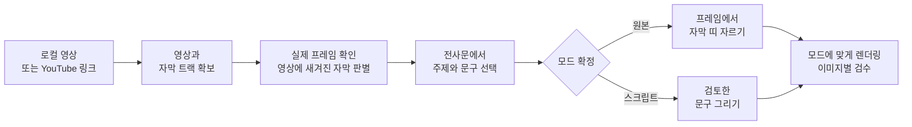

<a name="readme-top"></a>

<div align="center">
  

  <p><strong>실제 영상 프레임을 원본 자막 또는 스크립트 자막 이미지로</strong><br>
  <sub>원본 자막은 영상의 픽셀 그대로 · 스크립트 자막은 후편집 문구로 명시</sub></p>

  <p>
    <a href="#빠른-시작"><strong>빠른 시작</strong></a> &nbsp;·&nbsp;
    <a href="#주요-기능">주요 기능</a> &nbsp;·&nbsp;
    <a href="#완성-예시">완성 예시</a> &nbsp;·&nbsp;
    <a href="#두-가지-자막-모드">자막 모드</a> &nbsp;·&nbsp;
    <a href="README.md">中文</a> &nbsp;·&nbsp;
    <a href="README_EN.md">English</a>
  </p>

  <p>
    <a href="https://github.com/chengyi-ai/native-subtitle-quote-image/releases"></a>
    <a href="https://github.com/chengyi-ai/native-subtitle-quote-image/actions/workflows/validate.yml"></a>
    <a href="https://github.com/chengyi-ai/native-subtitle-quote-image/stargazers"></a>
    <a href="LICENSE"></a>
  </p>
</div>

## 주요 기능

- **영상에서 바로 이미지로**: 로컬 파일이나 YouTube 링크에서 문구를 고르고, 정확한 프레임을 추출해 콜라주를 만든 뒤 이미지별로 검수합니다. 내용에 맞는 높이나 지정한 비율로 JPG를 출력합니다.
- **두 가지 자막 모드**: 원본 자막 모드는 영상에 이미 새겨진 자막을 잘라 사용합니다. 스크립트 모드는 검토한 문구를 실제 프레임에 그리며 후편집 자막임을 명시합니다.
- **빈틈없는 구성**: 원본 자막은 영상 픽셀을 먼저 이어 붙인 뒤 전체를 같은 비율로 확대·축소합니다. 첫 줄만 따로 커지지 않습니다. 스크립트 고정 레이아웃은 주 이미지가 약 70%를 차지하며 자막 띠 사이에 여백이 없습니다.
- **Agent와 CLI 모두 지원**: Codex, Claude Code 등에서 한 문장으로 요청하거나 Python 스크립트를 직접 실행할 수 있습니다.

## 완성 예시

한국어 자막 결과물만 모았습니다. 모두 3:4, 5줄입니다. 중국어와 영어 예시는 [中文](README.md#成品案例), [English](README_EN.md#gallery) README에서 볼 수 있습니다. 이미지를 누르면 원본 크기로 열립니다.

<table>
  <tr>
    <td width="33%" align="center" valign="top"><strong>마수드 후세인</strong><br><sub>스크립트 자막 · 시작의 언덕</sub><br><a href="examples/gallery/ko/masud-husain-starting-hill.jpg"></a></td>
    <td width="33%" align="center" valign="top"><strong>코디 산체스</strong><br><sub>스크립트 자막 · 3-2-1 말하기</sub><br><a href="examples/gallery/ko/codie-sanchez-321-speaking.jpg"></a></td>
    <td width="33%" align="center" valign="top"><strong>이나야 맥밀란</strong><br><sub>스크립트 자막 · 돈의 운영체제</sub><br><a href="examples/gallery/ko/inaya-mcmillan-money-program.jpg"></a></td>
  </tr>
</table>

세 이미지 모두 **스크립트 자막**입니다. 검토한 한국어 번역 문구를 실제 프레임에 그려 넣은 결과물이며, 영상의 원래 자막이나 발언을 그대로 옮긴 인용문이 아닙니다. 원본 자막 예시는 중국어 README에서 볼 수 있습니다.

[출처, 문구와 타임스탬프](examples/README.md#한국어-예시)

<div align="right"><a href="#readme-top">↑ 맨 위로</a></div>

## 빠른 시작

**1. Skill 설치**

```bash
git clone https://github.com/chengyi-ai/native-subtitle-quote-image.git
cd native-subtitle-quote-image
mkdir -p ~/.codex/skills && cp -R skills/native-subtitle-quote-image ~/.codex/skills/
```

Windows PowerShell:

```powershell
New-Item -ItemType Directory -Force "$HOME\.codex\skills" | Out-Null
Copy-Item -Recurse skills\native-subtitle-quote-image "$HOME\.codex\skills\"
```

> 업그레이드할 때는 복사하기 전에 기존 폴더를 먼저 삭제하세요. 그렇지 않으면 새 버전에서 삭제된 파일이 남아 있을 수 있습니다(Claude Code는 `.codex`를 `.claude`로 바꾸세요).
>
> ```bash
> rm -rf ~/.codex/skills/native-subtitle-quote-image
> ```
>
> ```powershell
> Remove-Item -Recurse -Force "$HOME\.codex\skills\native-subtitle-quote-image"
> ```

<details>
<summary>Claude Code, Codex Skill Installer 또는 다른 Agent를 사용하나요?</summary>

<br>

**Claude Code**: Skill을 Claude Code의 Skills 폴더로 복사합니다.

```bash
mkdir -p ~/.claude/skills && cp -R skills/native-subtitle-quote-image ~/.claude/skills/
```

Windows PowerShell:

```powershell
New-Item -ItemType Directory -Force "$HOME\.claude\skills" | Out-Null
Copy-Item -Recurse skills\native-subtitle-quote-image "$HOME\.claude\skills\"
```

**Codex Skill Installer**: Codex에서 `$skill-installer`를 호출하고 아래 폴더를 설치해 달라고 요청합니다.

```text
https://github.com/chengyi-ai/native-subtitle-quote-image/tree/main/skills/native-subtitle-quote-image
```

**다른 Agent**: 이 프로젝트는 공개 Agent Skills 폴더 형식을 사용합니다. `skills/native-subtitle-quote-image/`를 해당 Agent의 Skills 폴더에 복사하고 활성화 방법은 해당 Agent의 문서를 확인하세요.

</details>

**2. 의존성 설치 및 환경 확인**

```bash
python3 -m pip install -r skills/native-subtitle-quote-image/requirements.txt
python3 skills/native-subtitle-quote-image/scripts/check_environment.py
```

YouTube 링크를 처리하려면 `yt-dlp`도 설치합니다.

```bash
python3 -m pip install -U "yt-dlp[default]"
python3 skills/native-subtitle-quote-image/scripts/check_environment.py --url-mode
```

한국어·중국어·일본어 문구를 그릴 때는 `--script-mode`로 폰트를 확인합니다. 환경 검사는 읽기 전용이며 소프트웨어를 자동 설치하거나 변경하지 않습니다. 구성 요소가 없으면 Agent가 용도를 설명하고 설치 동의를 구합니다.

**3. 새 Agent 작업에서 요청하기**

```text
$native-subtitle-quote-image를 사용해 이 영상에 이미 새겨진 자막을 그대로 살린 자막 콜라주를 만들어 줘.
```

<div align="right"><a href="#readme-top">↑ 맨 위로</a></div>

## 두 가지 자막 모드

모드를 지정하지 않으면 Agent가 먼저 원본 자막과 스크립트 자막의 차이를 설명하고 어떤 모드를 사용할지 묻습니다.

| | 원본 자막 | 스크립트 자막 |
|---|---|---|
| **사용 상황** | 플레이어의 CC를 꺼도 자막이 영상에 남아 있을 때 | 검토한 문구, 번역 또는 요점을 실제 프레임에 넣고 싶을 때 |
| **문자의 출처** | 영상 픽셀 자체. OCR로 다시 그리거나 번역·수정하지 않음 | 검토한 `lines[].text`. 후편집 자막임을 명시 |
| **명령어** | `render` | `render-script` |

> [!IMPORTANT]
> 원본 모드의 문자는 영상 픽셀에서만 가져옵니다. 스크립트 모드의 문자는 검토한 JSON에서만 가져오며, 원본 자막처럼 보이게 하지 않습니다.
> 원본 자막을 요청했는데 영상에 켜고 끌 수 있는 자막 트랙만 있다면, Agent는 한계를 설명하고 사용자가 동의한 뒤 스크립트 모드로 전환합니다.

### 작업 흐름



세 가지 방식으로 사용할 수 있습니다.

1. **로컬 영상**: 파일에서 문구를 고르고 프레임을 추출해 이미지를 만듭니다. `yt-dlp`가 필요하지 않습니다.
2. **링크 전체 처리**: 처리 권한이 있는 영상을 `yt-dlp`로 확보하고 메타데이터와 보조 자막 트랙을 확인한 뒤 모드를 결정합니다.
3. **콘텐츠 제작**: 영상을 읽고 주제를 정해 글이나 게시물을 작성한 뒤 자막 이미지를 만듭니다. 다른 콘텐츠 Skill이 분석과 글쓰기를 맡고, 이 Skill은 타임스탬프·실제 프레임·자막 출처 표시·검수를 맡습니다.

<div align="right"><a href="#readme-top">↑ 맨 위로</a></div>

## 한 문장으로 요청하기

| 상황 | Agent에게 할 요청 |
|---|---|
| 영상에 자막이 이미 새겨져 있음 | $native-subtitle-quote-image를 사용해 영상의 원본 자막을 그대로 살린 콜라주를 만들어 줘. |
| YouTube 링크가 있음 | $native-subtitle-quote-image로 이 링크를 처리해 줘. 다운로드 권한과 영상에 새겨진 자막을 먼저 확인하고, 주제 3개를 골라 콜라주를 만든 뒤 이미지별로 검수해 줘. |
| 글과 이미지를 함께 제작 | 타임스탬프가 있는 전사문에서 주제를 정하고 글을 쓴 다음, $native-subtitle-quote-image로 핵심 요점에 맞는 실제 프레임을 골라 줘. 원본 또는 스크립트 자막 모드를 먼저 정하고, 두 모드를 섞지 마. |
| 검토한 한국어 문구가 있음 | $native-subtitle-quote-image의 스크립트 모드로 이 한국어 문구와 타임스탬프를 실제 프레임에 넣어 줘. 빈틈없는 3:4 이미지를 만들고 각 결과를 검수해 줘. |

> [!TIP]
> `$native-subtitle-quote-image`는 Codex 표기입니다. Claude Code에서는 `/native-subtitle-quote-image`를 사용하거나 원하는 작업을 직접 설명하면 됩니다.

모드 확정 후 전달되는 결과물:

- 선택한 레이아웃에 맞는 개별 JPG;
- 원본 모드의 `原生字幕时间点.json` 또는 스크립트 모드의 `lines` JSON;
- 여러 장을 만들 때의 `final_contact_sheet.jpg` 미리보기.

<div align="right"><a href="#readme-top">↑ 맨 위로</a></div>

## 명령줄 사용법

Agent 없이 스크립트를 직접 실행할 수도 있습니다. `VIDEO`를 실제 영상 경로로 바꾸세요.

**소스 점검**: 다운로드 후 해상도를 확인하고 처음 10초를 디코딩해, 손상되었거나 저해상도인 소스를 프레임 추출 전에 걸러냅니다(`--min-height`를 생략하면 720p 미만은 경고만 합니다).

```bash
python3 skills/native-subtitle-quote-image/scripts/native_subtitle_stitch.py check-source VIDEO --min-height 720
```

**후보 프레임 선택**: 타임스탬프가 있는 후보 프레임 시트를 만듭니다.

```bash
python3 skills/native-subtitle-quote-image/scripts/native_subtitle_stitch.py sample VIDEO \
  --start 30 --end 120 --interval 5 --out candidate-contact-sheet.jpg
```

`--start`, `--end`, `--interval`을 생략하면 영상 전체에서 최대 24개 프레임을 균등하게 추출합니다. 대략적인 시점을 알면 각 시점의 앞·중간·뒤 프레임을 비교해 자막 전환 순간을 피할 수 있습니다.

```bash
python3 skills/native-subtitle-quote-image/scripts/native_subtitle_stitch.py sample VIDEO \
  -t 61.2 -t 68.9 -t 74.5 -t 82.0 -t 88.4 \
  --around 0.8 --out focused-candidates.jpg
```

**원본 자막**: `band`로 자막 영역을 확인하고 manifest에 따라 렌더링합니다.

```bash
python3 skills/native-subtitle-quote-image/scripts/native_subtitle_stitch.py band VIDEO \
  -t 61.2 --band-top 0.78 --band-bottom 0.96 --out band-preview.jpg

python3 skills/native-subtitle-quote-image/scripts/native_subtitle_stitch.py render VIDEO \
  --manifest manifest.json --out-dir output-v1 \
  --band-top 0.78 --band-bottom 0.96
```

**스크립트 자막**: 검토한 문구를 `script.json`에 넣고 렌더링합니다.

```bash
python3 skills/native-subtitle-quote-image/scripts/native_subtitle_stitch.py render-script VIDEO \
  --script script.json --out output.jpg --aspect 3:4 --width 1440
```

**선택형 6줄 카드**: `script.json`에 검토한 문구 6줄과 엄격히 증가하는 타임스탬프를 넣습니다. 1080×1440에서는 상단 주 화면 870px와 빈틈없이 이어지는 114px 자막 띠 5개를 사용하며, 여섯 줄의 중심 간격이 같습니다. 기존 스크립트 레이아웃은 기본값으로 유지됩니다.

```bash
python3 skills/native-subtitle-quote-image/scripts/native_subtitle_stitch.py render-script VIDEO \
  --script script.json --out six-line.jpg --six-line-card --aspect 3:4 --width 1080
```

`--six-line-card`는 후편집 스크립트 자막에만 적용되며 `--layout natural` 또는 `--hero-fraction`과 함께 사용할 수 없습니다. 자막 띠는 기본적으로 원본 프레임 높이의 60% 지점에서 추출하며 `--band-center`로 조정할 수 있습니다. 각 문구의 출처와 완성 이미지를 확인하세요.

**선택: 화자 접두어**: 스크립트 모드의 질의응답·대담 이미지에서 `script.json`의 각 문장에 `"speaker": "진행자"`를 넣고 `--speaker-prefix on-change`를 쓰면 화자가 바뀔 때만 `진행자:` 같은 접두어를 그립니다. `every`는 모든 문장에, `none`(기본값)은 그리지 않습니다. 접두어는 문장보다 작고 강조색을 쓰며, 문장이 들어가는 경우 접두어 때문에 문장 글자가 작아지지 않습니다. 화자는 `text`가 아니라 `speaker` 필드에 적습니다.

```bash
python3 skills/native-subtitle-quote-image/scripts/native_subtitle_stitch.py render-script VIDEO \
  --script script.json --out qa.jpg --speaker-prefix on-change
```

**원본 비율과 가로 구도 유지(v2.2.0)**: 두 모드 모두 `--layout natural`을 지원합니다. `--width`를 생략하면 원본 너비를 유지하며 높이는 실제 내용에 따라 결정됩니다. 너비를 지정해도 같은 비율로 확대·축소합니다.

```bash
# 원본 자막: 영상 픽셀 유지
python3 skills/native-subtitle-quote-image/scripts/native_subtitle_stitch.py render VIDEO \
  --manifest manifest.json --out-dir output-natural --layout natural

# 스크립트 자막: 불필요한 하단만 자르기
python3 skills/native-subtitle-quote-image/scripts/native_subtitle_stitch.py render-script VIDEO \
  --script script.json --out natural.jpg --layout natural --frame-bottom 0.72
```

`0.72`는 예시이며 영상별로 확인해야 합니다. 기본값 `--frame-top 0 --frame-bottom 1`은 전체 프레임을 유지합니다. `--band-center`는 자른 뒤의 프레임을 기준으로 합니다. natural 레이아웃은 `--aspect`나 `--hero-fraction`과 함께 사용할 수 없습니다. 원본 비율로 만든 스크립트 자막도 후편집 자막입니다.

**원본 자막 기본 레이아웃(v2.2.2)**: `render`에서 레이아웃과 비율을 생략하면 원본 너비를 유지하고 내용에 맞춰 높이를 계산합니다. `--aspect 3:4 --width 1440`을 명시하면 1440×1920으로 출력하되, 자막을 온전히 남기도록 콜라주 전체를 같은 비율로 확대·축소하며 주 이미지와 자막 띠를 따로 늘려 채우지 않습니다(v2.2.2는 검은 여백으로 캔버스를 맞췄고, v2.3.0부터는 기본으로 양옆을 먼저 자릅니다. 아래 참고). 원본 모드의 `--hero-fraction`은 원본 프레임 범위 안에서 주 이미지의 잘라낼 높이만 조절합니다. 스크립트 모드는 기본적으로 고정 3:4를 사용합니다. 가로와 세로를 서로 다르게 늘려 비율을 맞추지 마세요.

**가로 영상을 3:4로 만들 때 여백 줄이기(v2.3.0)**: 원본 자막 고정 캔버스의 기본값은 `--fit crop`입니다. 각 자막의 좌우 경계를 감지한 뒤 모든 자막이 안전하게 남는 범위에서 콜라주 양옆을 함께 자르고, 부족한 부분만 검은 여백으로 채웁니다. 모든 자막은 같은 배율을 유지합니다. 한 줄이라도 경계를 감지하지 못하면 자르지 않고 여백을 추가합니다. 인물이 한쪽에 있으면 `--crop-center 0.4`처럼 자르는 위치를 옮길 수 있으며, 자르는 범위에는 항상 모든 자막이 들어갑니다. v2.2.2의 여백 방식은 `--fit pad`로 선택합니다. 렌더링 후 자막 양 끝이 온전히 보이는지 확인하세요.

<details>
<summary><code>script.json</code> 형식</summary>

<br>

`text`는 검토한 한 줄 문구여야 하며 `t`는 실제 영상의 타임스탬프로, 앞 줄보다 반드시 커야 합니다.

```json
{
  "lines": [
    {"t": 61.6, "text": "검토한 첫 번째 문구"},
    {"t": 69.3, "text": "검토한 두 번째 문구"},
    {"t": 75.0, "text": "검토한 세 번째 문구"},
    {"t": 82.4, "text": "검토한 네 번째 문구"},
    {"t": 88.8, "text": "검토한 다섯 번째 문구"}
  ]
}
```

스크립트는 일반적인 시스템 CJK 폰트를 자동으로 찾으며, 한글 문구에는 Apple SD Gothic Neo / Malgun Gothic을 먼저 시도합니다. 찾지 못하면 `--font /path/to/font.ttc`로 지정하세요. 문구가 너무 길면 글씨를 줄이기보다 문구를 나누거나 여러 장으로 구성하세요.

</details>

기본 동작:

- 두 렌더러 모두 자막 띠 수에 따라 주 이미지 높이를 조절합니다. [시각 구성 가이드](skills/native-subtitle-quote-image/references/visual-style.md)를 참고하세요.
- 원본 한 줄 자막은 영상 높이의 `0.78–0.96` 영역부터 확인합니다.
- 이미지 한 장에는 타임스탬프를 최대 7개(주 이미지 1개 + 자막 띠 6개)까지 씁니다. 더 긴 내용은 여러 장으로 나눕니다.
- 기존 파일은 `--overwrite`를 지정해야 덮어씁니다.
- 일괄 `render`는 기본적으로 첫 실패에서 중단됩니다. `--keep-going`을 쓰면 한 장이 실패해도 나머지를 계속 렌더링하고, 실패 목록(몇 번째 카드, 시간점, 원인)을 출력하며 출력 폴더의 `渲染失败报告.json`에 기록합니다. 종료 코드는 0이 아닙니다. 수정 후 `--resume`을 쓰면 누락되었거나 손상된 카드만 다시 렌더링합니다. 정상 카드는 manifest가 바뀌어도 다시 렌더링하지 않으며, 총괄 이미지와 시간점 파일은 새로 생성됩니다.
- 렌더링 전에 중복 화면을 검사합니다. 모든 타임스탬프의 화면이 거의 같거나(예: 원본 영상이 정지된 표지 이미지뿐인 경우), 원본 자막 모드에서 이웃한 자막 띠 두 개가 거의 같으면 이미지를 만들지 않고 중단합니다. 의도한 결과라면 `--allow-duplicate-frames`를 추가하세요.
- 전체 옵션은 `--help`로 확인합니다.

<div align="right"><a href="#readme-top">↑ 맨 위로</a></div>

## 활용 범위

| 적합한 경우 | 적합하지 않은 경우 |
|---|---|
| CC를 꺼도 영상에 자막이 남아 있고 이를 그대로 쓰고 싶음 | 원본 자막을 원하지만 영상에 별도 자막 트랙만 있음 |
| 확인 가능한 타임스탬프와 검토한 문구가 있음 | 문구나 번역을 확인하지 않았거나 영상에 없는 발언을 만들고 싶음 |
| 영상과 결과물을 처리·게시할 권한이 있음 | 저화질 영상을 실제 고화질처럼 바꾸고 싶음 |

직접 촬영하고 자막을 넣은 영상, 허가받은 자료 또는 재사용이 명확히 허용된 영상을 우선 사용하세요. 공개 게시 전에 필요한 사용 권한을 확인하세요.

<details>
<summary><strong>영상에 새겨진 자막이 없으면 어떻게 하나요?</strong></summary>

<br>

많은 영상은 플레이어에서 켜고 끄는 CC 트랙을 사용합니다. 다운로드한 프레임에 자막이 없다면 원본 자막 모드를 사용할 수 없습니다.

**확인 방법**: CC를 끄고 영상을 보거나, 다운로드한 파일에서 `sample`로 프레임을 추출하세요. VTT/SRT 파일을 받았다는 사실만으로 영상 픽셀에 자막이 있다는 뜻은 아닙니다.

**찾기 쉬운 자료**: 직접 편집해 자막을 영상에 새긴 파일, 제작자가 자막을 넣은 인터뷰·발표 영상 등입니다. 다른 사람이 재게시한 클립은 사용 권한을 확인해야 합니다.

**대안**: 스크립트 모드로 전환하세요. 자막 트랙이나 Whisper 전사문으로 타임스탬프를 찾고, 검토한 문구를 `script.json`에 넣어 `render-script`로 만듭니다. 결과물은 후편집 자막으로 표시됩니다.

</details>

<details>
<summary><strong>인터뷰·대담처럼 여러 사람이 말하는 영상</strong></summary>

<br>

이미지는 타임스탬프 순서대로만 이어 붙이며, 누가 말하는지는 알지 못합니다. 자막 띠는 화면 아래쪽만 잘라 쓰기 때문에, 보는 사람은 모든 문장을 메인 화면 속 인물의 말로 받아들입니다. YouTube 자막 트랙과 일반 Whisper 전사본에도 화자 정보가 없습니다. 그래서 여러 사람이 나오는 영상에서 "이어지는 몇 문장"을 그대로 고르면 진행자의 질문과 게스트의 답이 섞여, 누가 한 말인지 알 수 없고 순서도 어긋나 보입니다.

이제 Skill은 다음과 같이 처리합니다.

- 문장을 고르기 전에 전사본에 화자를 표시하고, 애매한 문장은 화면으로 다시 확인하며, 그래도 확인되지 않으면 쓰지 않습니다.
- 기본적으로 이미지 한 장에는 한 사람의 말만 담고, 메인 화면도 그 사람이 말하는 장면으로 고릅니다.
- "질문과 답" 구성을 원하면 먼저 확인하며, 질문과 답은 원본에서 바로 이어져야 합니다. 원본 자막 모드는 화면에 화자를 덧붙일 수 없으므로, 전달할 때 문장마다 화자를 적어 둡니다. 스크립트 모드에서는 `--speaker-prefix`로 화면에 화자를 표시할 수 있습니다(아래 참고).
- YouTube 자동 자막은 롤링 방식이라 같은 문장이 반복되고 시작 시간이 이릅니다. 먼저 중복을 정리한 뒤 시간점을 정합니다.

요청할 때 "2인 인터뷰이니 게스트가 이어서 한 말만 골라 줘"처럼 미리 알려 주면 됩니다.

</details>

<div align="right"><a href="#readme-top">↑ 맨 위로</a></div>

## 추가 안내

<details>
<summary><strong>프로젝트 상태와 기술 정보</strong></summary>

<p>
  
  <a href="skills/native-subtitle-quote-image"></a>
  <a href=".codex-plugin/plugin.json"></a>
  <a href="https://github.com/chengyi-ai/native-subtitle-quote-image/releases"></a>
  <a href="https://github.com/chengyi-ai/native-subtitle-quote-image/commits/main"></a>
  <a href="https://github.com/chengyi-ai/native-subtitle-quote-image/network/members"></a>
  <a href="https://github.com/chengyi-ai/native-subtitle-quote-image/issues"></a>
</p>

</details>

<details>
<summary><strong>필요한 구성 요소</strong></summary>

<br>

| 구성 요소 | 로컬 영상 | 링크 처리 | 용도 |
|---|:---:|:---:|---|
| 이 Skill | 필수 | 필수 | 프레임 선택, 자르기, 콜라주, 검수 |
| Python 3.10+ | 필수 | 필수 | 스크립트 실행 |
| Pillow | 필수 | 필수 | 이미지 처리와 JPG 출력 |
| `imageio-ffmpeg` 또는 FFmpeg | 필수 | 필수 | 영상 디코딩과 정밀 프레임 추출 |
| `yt-dlp` | - | 필수 | 영상, 메타데이터, 자막 트랙 확보 |
| Deno 또는 명시적으로 활성화한 Node.js | - | YouTube에 필수 | YouTube 형식 분석 |
| Whisper 또는 음성 인식 Skill | 선택 | 선택 | 자막 트랙이 없을 때 시간 인덱스 생성 |
| CJK 폰트 | CJK 스크립트 모드에 필수 | CJK 스크립트 모드에 필수 | 한국어·중국어·일본어 문구 그리기 |
| 콘텐츠 분석·글쓰기 Skill | 선택 | 선택 | 주제와 게시물 작성 |

</details>

<details>
<summary><strong>YouTube에서 로그인 확인을 요구하는 경우</strong></summary>

<br>

링크 모드는 먼저 공개 접근을 시도합니다. 로그인·연령 확인이 필요하거나 본인의 비공개 영상이면 Agent가 원인을 설명하고 `yt-dlp`가 Chrome 로그인 Cookie를 임시로 읽어도 되는지 묻습니다.

동의하면 메타데이터, 자막, 영상 다운로드 명령에 `--cookies-from-browser chrome`을 사용합니다.

```bash
yt-dlp --cookies-from-browser chrome --js-runtimes node \
  --no-playlist --skip-download \
  --print "%(id)s | %(title)s | %(duration_string)s" \
  "URL"
```

Cookie는 내보내거나 저장·업로드하지 않으며 저장소에도 넣지 않습니다. yt-dlp는 현재 Deno를 권장합니다. 이미 Node.js가 있다면 `--js-runtimes node`를 명시해 사용할 수 있습니다. 자세한 절차는 [URL 처리 가이드](skills/native-subtitle-quote-image/references/yt-dlp-and-transcripts.md#chrome-cookie-授权流程)를 참고하세요.

</details>

<details>
<summary><strong>버전 업데이트 알림</strong></summary>

<br>

새 작업 시작 시 Skill의 `VERSION`과 GitHub 최신 릴리스를 비교합니다.

```bash
python3 skills/native-subtitle-quote-image/scripts/check_update.py --json
```

성공한 확인 결과는 24시간 캐시됩니다. 새 버전이 있으면 버전과 링크만 알려주며 설치된 Skill을 자동으로 덮어쓰지 않습니다. 네트워크 오류나 접근 거부가 있어도 영상 작업은 계속됩니다. 캐시에는 확인 시간, 최신 버전, 릴리스 링크만 저장됩니다.

즉시 다시 확인하려면:

```bash
python3 skills/native-subtitle-quote-image/scripts/check_update.py --force --verbose
```

</details>

<details>
<summary><strong>대표 이미지 수정</strong></summary>

<br>

대표 이미지는 `scripts/render_banners.py`로 만들며, 중국어·영어·한국어 2560×1280 JPG가 하나씩 `assets/`에 있습니다. `examples/gallery`의 완성 예시를 어두운 배경에 깔아 GitHub 라이트 테마와 다크 테마에서 같은 이미지를 씁니다. 문구는 스크립트 맨 위의 `COPY`를, 배경에 쓸 예시는 `WALL`을 고친 다음 아래 명령을 실행합니다.

```bash
python3 scripts/render_banners.py
```

로컬에 Chrome 또는 Chromium이 필요하며, 렌더링할 때 Google Fonts에서 폰트를 불러옵니다. 브라우저를 찾지 못하면 `--chrome /path/to/chrome`으로 지정하세요. Linux에서 이미지 아래쪽이 잘리면 `chrome-headless-shell`로 렌더링하세요.

중국어 대표 이미지 `assets/banner-zh.jpg`는 저장소 소셜 미리보기로도 씁니다. 저장소 Settings → General → Social preview에 올리면 저장소 링크를 공유할 때 이 이미지가 보입니다.

</details>

<details>
<summary><strong>검증 명령</strong></summary>

<br>

```bash
python3 scripts/validate_repo.py
python3 -m unittest discover -s tests -v
python3 skills/native-subtitle-quote-image/scripts/check_environment.py
python3 skills/native-subtitle-quote-image/scripts/native_subtitle_stitch.py --help
python3 skills/native-subtitle-quote-image/scripts/native_subtitle_stitch.py render-script --help
```

GitHub Actions가 push와 pull request마다 Python 3.10과 3.13에서 검증합니다.

</details>

**상세 참고 문서**: 아래 문서는 중국어로 작성되어 있으며 명령어는 언어와 관계없이 같습니다.

- [영상 링크, yt-dlp, Deno/Node, 타임라인](skills/native-subtitle-quote-image/references/yt-dlp-and-transcripts.md)
- [주제 선택, 프레임 확인, 렌더링과 검수](skills/native-subtitle-quote-image/references/end-to-end-workflow.md)
- [주 이미지와 자막 띠의 시각 구성](skills/native-subtitle-quote-image/references/visual-style.md)

## 피드백과 기여

버그나 제안은 [Issues](https://github.com/chengyi-ai/native-subtitle-quote-image/issues)에 남기거나(렌더링 문제라면 문제가 생긴 페이지의 스크린샷을 첨부해 주세요) 소셜 미디어로 작성자에게 알려 주세요. 새 issue는 에이전트가 실현 가능성을 먼저 평가하고, 조건을 충족하면 에이전트가 코드 작성·테스트 후 PR을 올립니다. 메인테이너가 검토해 병합하면 자동으로 배포됩니다. 전체 흐름은 [에이전트 워크플로 안내](docs/agent-workflow.md)(중국어)를 참고하세요.

## Star History

<a href="https://www.star-history.com/?repos=chengyi-ai%2Fnative-subtitle-quote-image&type=date&legend=top-right">
  <picture>
    <source media="(prefers-color-scheme: dark)" srcset="https://api.star-history.com/chart?repos=chengyi-ai/native-subtitle-quote-image&type=date&theme=dark&legend=top-left" />
    <source media="(prefers-color-scheme: light)" srcset="https://api.star-history.com/chart?repos=chengyi-ai/native-subtitle-quote-image&type=date&legend=top-left" />
    
  </picture>
</a>

<p align="center">
  <a href="https://trendshift.io/repositories/169845?utm_source=trendshift-badge&amp;utm_medium=badge&amp;utm_campaign=badge-trendshift-169845" target="_blank" rel="noopener noreferrer"></a>
  <a href="https://trendshift.io/repositories/169845?utm_source=trendshift-badge&amp;utm_medium=badge&amp;utm_campaign=badge-trendshift-169845" target="_blank" rel="noopener noreferrer"></a>
</p>

## 만든 사람

| 플랫폼 | 계정 |
| --- | --- |
| 𝕏 Twitter | [@ChengYi3629](https://x.com/ChengYi3629) |
| 📕 샤오훙수(小红书) | [程意](https://www.xiaohongshu.com/user/profile/648c0e99000000001001f148) |

## 라이선스

코드와 Skill 지침은 [MIT 라이선스](LICENSE)로 공개합니다. 예시 이미지는 결과물의 형태를 보여 주기 위한 것입니다. 입력 영상, 생성 이미지와 그 안에 나오는 제3자 콘텐츠는 이 라이선스로 추가 사용 권한을 얻지 않습니다.

<div align="right"><a href="#readme-top">↑ 맨 위로</a></div>
